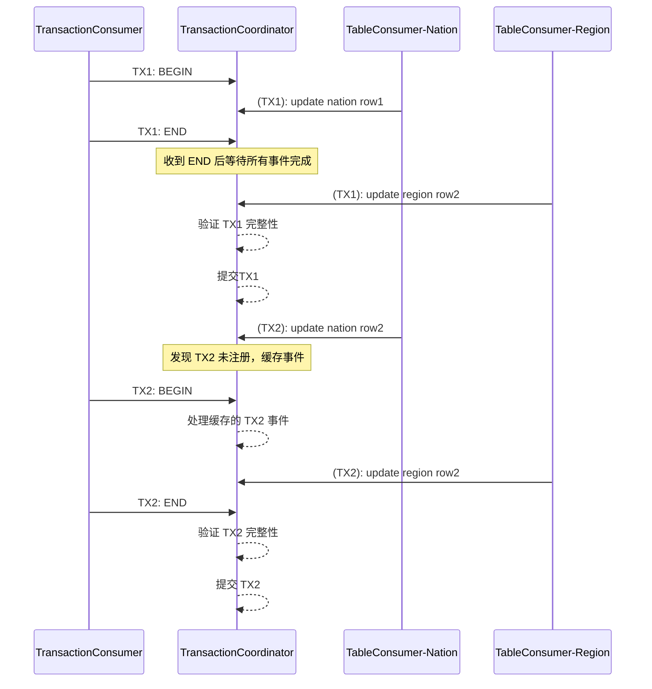

# 事务处理机制

假设同一表上，保证按照事务顺序读取RowRecord

```mermaid
sequenceDiagram
    participant TC as TransactionConsumer
    participant CO as TransactionCoordinator
    participant T1 as TableConsumer-Nation
    participant T2 as TableConsumer-Region
%% 事务 TX1 生命周期
    TC ->> CO: TX1: BEGIN
    T1 ->> CO: (TX1): update nation row1
    TC ->> CO: TX1: END
    Note over CO: 收到 END 后等待所有事件完成
%% TX1 的延迟事件处理
    T2 ->> CO: (TX1): update region row2
    CO -->> CO: 验证 TX1 完整性
    CO -->> CO: 提交TX1
%% 事务 TX2 生命周期（注意事件到达顺序问题）
    T1 ->> CO: (TX2): update nation row2
    Note over CO: 发现 TX2 未注册，缓存事件
    TC ->> CO: TX2: BEGIN
    CO -->> CO: 处理缓存的 TX2 事件
    T2 ->> CO: (TX2): update region row2
    TC ->> CO: TX2: END
    CO -->> CO: 验证 TX2 完整性
    CO -->> CO: 提交 TX2
```

